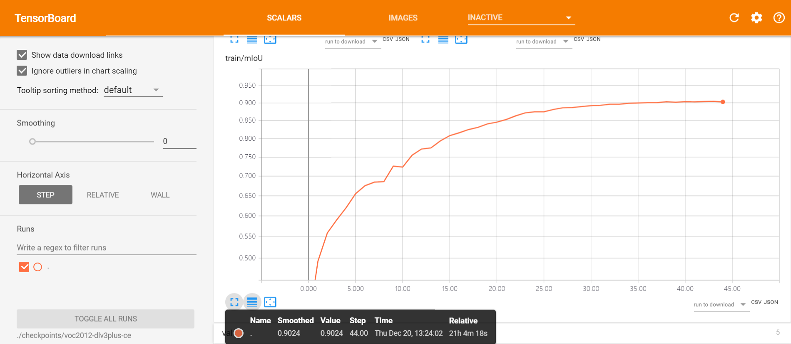
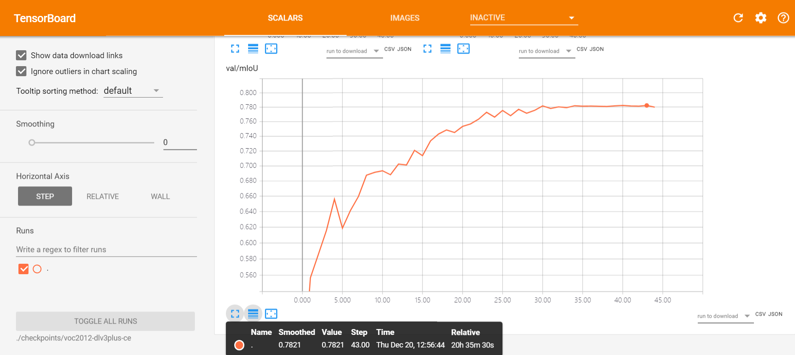
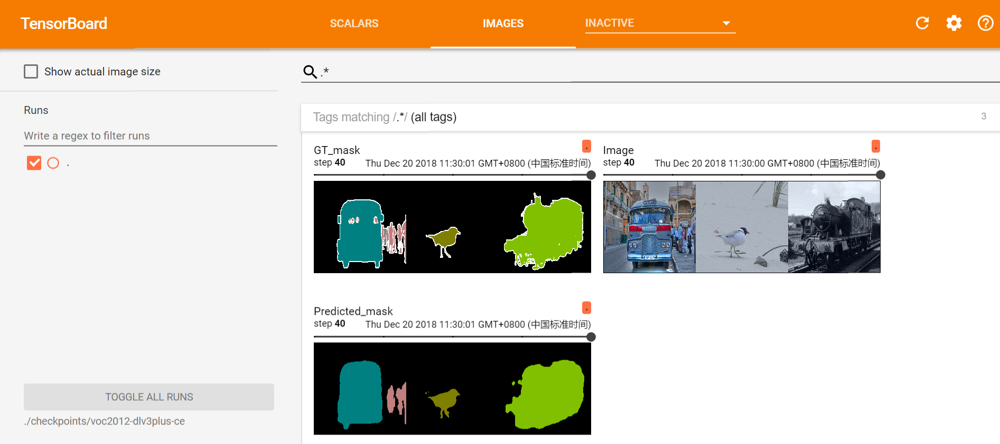

# A *ImageSegmentation* Pytorch Implementation of various models and datasets


## Introduction
Still working in progress!
Trying to include more models and datasets in a similar and simple way.


## Datasets
To train and validate the network, this repo use the augmented PASCAL VOC 2012 dataset which contains 10582 images for training and 1449 images for validation.

## Training
Make sure to look at the config.py and change it as you like, then run main.py
Finally you will get the ckpt and log in [checkpoint/](https://github.com/silkylove/Pytorch-ImageSegmentation/tree/master/checkpoint) and [log/](https://github.com/silkylove/Pytorch-ImageSegmentation/tree/master/log)

```
Run 
tensorboard --logdir log 
to see the training log.
```

## TODO
- [x] Unet, PSPNet, DeepLabV3+
- [x] Resnet backbones
- [x] VOC2012 dataset
- [ ] More models including Unet-like Resnet based AutoEncoder ...
- [ ] More backbones including scSE-ResneXt101, Xception and Mobile net
- [ ] Deformable CNN
- [ ] More datasets including some medical datasets, eg, COCO

## Results untill now
Now I had done the experiments on deeplabv3+ (one can get the training log under /log):
Performance with 4 1080ti:
Deeplabv3+ on VOC2012 with 16 batchsize and 30K iterations.

| Backbone | train/val OS| mIoU paper| mIoU repo|
| :--------| :----------:|:---------:|:--------:|
| Resnet101|      16     |  78.85%   |  77.95%  |






## Requirements
Python(3.6) and Pytorch(1.0.0) is necessary before running the scripts.
To install the required python packages(expect PyTorch), run
```python
pip install -r requirements.txt
```